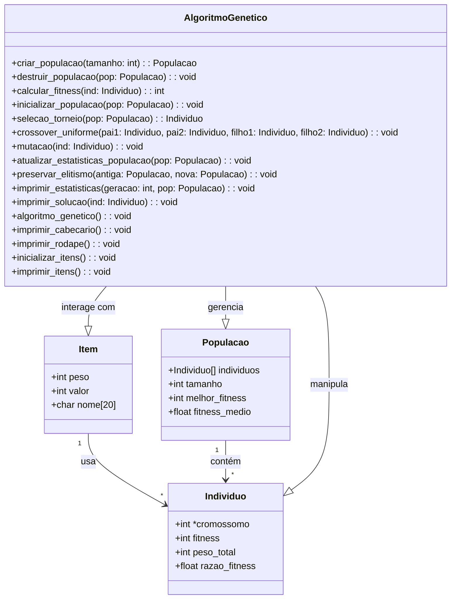

# Algoritmo Genético para o Problema da Mochila

Este projeto implementa um Algoritmo Genético (AG) para resolver o Problema da Mochila - um problema clássico de otimização onde precisamos selecionar itens com diferentes pesos e valores para maximizar o valor total, respeitando uma restrição de capacidade de peso.

## Estrutura do Projeto



## Funcionalidades

- Implementação dos componentes principais do Algoritmo Genético:
  - Seleção por Torneio
  - Crossover Uniforme
  - Mutação
  - Elitismo
- Geração aleatória de itens com parâmetros configuráveis
- Acompanhamento de progresso e estatísticas
- Saída formatada dos resultados
- Gerenciamento de memória para populações dinâmicas

## Parâmetros de Configuração

Os seguintes parâmetros podem ser ajustados no código:

```c
#define NUM_ITENS 26           // Número de itens disponíveis
#define TAM_POPULACAO 100      // Tamanho da população
#define NUM_GERACOES 100       // Número de gerações
#define TAXA_MUTACAO 0.15      // Taxa de mutação
#define TAXA_ELITISMO 0.1      // Taxa de elitismo
#define CAPACIDADE 10          // Capacidade da mochila
#define TAMANHO_TORNEIO 3      // Tamanho do torneio para seleção
```

## Compilação e Execução

### Pré-requisitos
- Compilador GCC
- Make (opcional)

### Como compilar
```bash
gcc -o mochila main.c
```

### Como executar
```bash
./mochila
```

## Formato da Saída

O programa gera:
1. Lista inicial de itens com pesos e valores
2. Progresso geração por geração
3. Solução final incluindo:
   - Itens selecionados
   - Peso total
   - Valor total
   - Fitness da solução

Exemplo de saída:
```
+-----------+--------+--------+
| Item      | Peso   | Valor  |
+-----------+--------+--------+
| Item 1    |      5 |     12 |
...

+---------------------------------------------+
| Geracao  | Melhor Fitness | Fitness Medio   |
+---------------------------------------------+
...
```

## Detalhes da Implementação

### Componentes Principais

1. **Estrutura Item**
   - Representa itens individuais com peso, valor e nome

2. **Estrutura Indivíduo**
   - Representa uma possível solução
   - Contém cromossomo (seleção binária de itens)
   - Controla fitness e peso total

3. **Estrutura População**
   - Gerencia coleção de indivíduos
   - Controla melhor fitness e fitness médio

### Operações Genéticas

1. **Seleção**
   - Seleção por torneio com tamanho configurável
   - Seleciona pais para crossover

2. **Crossover**
   - Crossover uniforme entre soluções pais
   - Cria novas soluções filhas

3. **Mutação**
   - Mutação por inversão de bits aleatória
   - Mantém diversidade da população

4. **Elitismo**
   - Preserva melhores soluções entre gerações
   - Taxa de elitismo configurável

