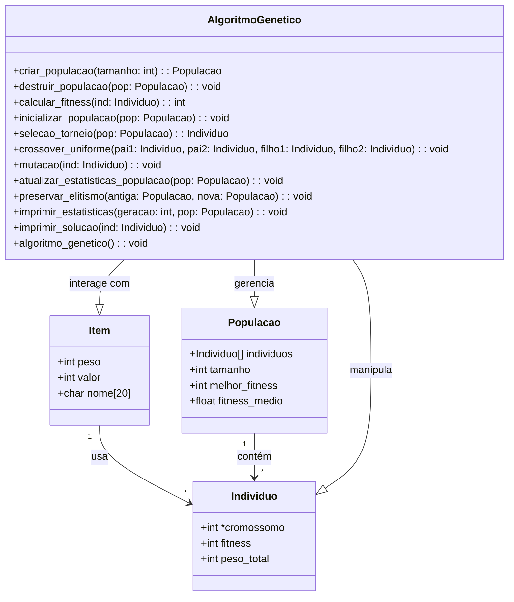

# Algoritmo Genético para o Problema da Mochila

Esta implementação utiliza um Algoritmo Genético (AG) para resolver o Problema da Mochila 0/1, um problema clássico de otimização combinatória. O objetivo é selecionar um conjunto de itens com diferentes pesos e valores para maximizar o valor total, respeitando uma restrição de capacidade.

## Sobre o Algoritmo Genético

O AG implementado utiliza uma abordagem evolutiva onde:
- Cada solução é representada como um cromossomo binário
- A população evolui através de operadores genéticos
- O fitness é calculado considerando o valor total e a viabilidade do peso
- Técnicas de elitismo garantem a preservação das melhores soluções

## Diagrama de Classes



## Características da Implementação

### Estruturas de Dados
1. **Item**
   - `peso`: Peso do item (inteiro)
   - `valor`: Valor do item (inteiro)
   - `nome`: Identificador do item (string)

2. **Indivíduo**
   - `cromossomo`: Array binário representando seleção de itens
   - `fitness`: Valor da função objetivo
   - `peso_total`: Soma dos pesos dos itens selecionados
3. **População**
   - `individuos`: Array de soluções candidatas
   - `tamanho`: Número de indivíduos
   - `melhor_fitness`: Melhor valor encontrado
   - `fitness_medio`: Média de fitness da população

### Operadores Genéticos

1. **Seleção por Torneio**
   ```c
   Individuo *selecao_torneio(Populacao *pop)
   ```
   - Seleciona k indivíduos aleatoriamente
   - Retorna o melhor entre os selecionados
   - Tamanho do torneio configurável (TAMANHO_TORNEIO)

2. **Crossover Uniforme**
   ```c
   void crossover_uniforme(Individuo *pai1, Individuo *pai2, 
                          Individuo *filho1, Individuo *filho2)
   ```
   - Combina genes dos pais com probabilidade igual
   - Gera dois filhos por operação
   - Mantém diversidade genética

3. **Mutação**
   ```c
   void mutacao(Individuo *ind)
   ```
   - Inverte bits aleatoriamente
   - Taxa controlada por TAXA_MUTACAO
   - Explora novas regiões do espaço de busca

4. **Elitismo**
   ```c
   void preservar_elitismo(Populacao *antiga, Populacao *nova)
   ```
   - Preserva melhores indivíduos entre gerações
   - Percentual definido por TAXA_ELITISMO
   - Garante não-degradação da melhor solução

## Parâmetros Configuráveis

```c
// Parâmetros do Problema
#define NUM_ITENS 50           // Quantidade de itens disponíveis
#define CAPACIDADE 20          // Capacidade máxima da mochila

// Parâmetros do AG
#define TAM_POPULACAO 300      // Tamanho da população
#define NUM_GERACOES 300       // Número de gerações
#define TAXA_MUTACAO 0.1      // Probabilidade de mutação
#define TAXA_ELITISMO 0.3      // Proporção de elite preservada
#define TAMANHO_TORNEIO 3      // Número de indivíduos por torneio
```

## Compilação e Execução

### Compilando
```bash
# Usando GCC diretamente
gcc -o mochila_ag main.c -Wall -O2
```

### Executando
```bash
./mochila_ag
```

## Formato da Saída

### 1. Lista de Itens
```
+-----------+--------+--------+
| Item      | Peso   | Valor  |
+-----------+--------+--------+
| Item 1    |      5 |     12 |
| Item 2    |      3 |      8 |
...
+-----------+--------+--------+
```

### 2. Progresso da Evolução
```
+---------------------------------------------+
| Geracao  | Melhor Fitness | Fitness Medio   |
+---------------------------------------------+
|      10  |           145  |         122.5   |
|      20  |           167  |         134.8   |
...
+---------------------------------------------+
```

### 3. Solução Final
```
Melhor solucao encontrada:
Cromossomo: 1 0 1 0 1 ...
Fitness: 167
Peso Total: 19

Itens selecionados:
+-----------+--------+--------+
| Item      | Peso   | Valor  |
+-----------+--------+--------+
| Item 1    |      5 |     12 |
...
+-----------+--------+--------+
```

## Gerenciamento de Memória

A implementação inclui:
- Alocação dinâmica de populações
- Liberação apropriada de recursos
- Verificações de alocação
- Prevenção de vazamentos de memória
