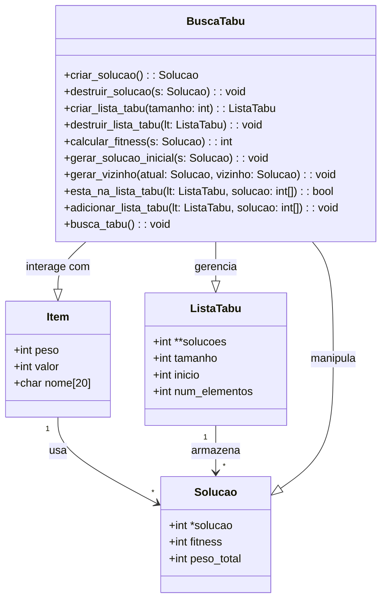

# Busca Tabu para o Problema da Mochila

Este projeto implementa um algoritmo de Busca Tabu para resolver o Problema da Mochila - um problema clássico de otimização onde precisamos selecionar itens com diferentes pesos e valores para maximizar o valor total, respeitando uma restrição de capacidade de peso.

## Estrutura do Projeto



## Funcionalidades

- Implementação dos componentes principais da Busca Tabu:
  - Lista Tabu com tamanho configurável
  - Geração de vizinhança
  - Critério de aspiração
  - Intensificação e diversificação
- Geração aleatória de itens com parâmetros configuráveis
- Acompanhamento de progresso e estatísticas
- Saída formatada dos resultados
- Gerenciamento de memória dinâmica

## Parâmetros de Configuração

Os seguintes parâmetros podem ser ajustados no código:

```c
#define NUM_ITENS 50           // Número de itens disponíveis
#define TABU_SIZE 20          // Tamanho da lista tabu
#define MAX_ITERATIONS 1000    // Número máximo de iterações
#define VIZINHOS_SIZE 20      // Tamanho da vizinhança
#define CAPACIDADE 20         // Capacidade da mochila
```

## Compilação e Execução

### Pré-requisitos
- Compilador GCC
- Make (opcional)

### Como compilar
```bash
gcc -o mochila_tabu main.c
```

### Como executar
```bash
./mochila_tabu
```

## Formato da Saída

O programa gera:
1. Lista inicial de itens com pesos e valores
2. Progresso iteração por iteração
3. Solução final incluindo:
   - Itens selecionados
   - Peso total
   - Valor total (fitness)

Exemplo de saída:
```
+-----------+--------+--------+
| Item      | Peso   | Valor  |
+-----------+--------+--------+
| Item 1    |      5 |     12 |
...

+--------------------------------+
| Iteracao | Melhor Fitness      |
+--------------------------------+
...
```

## Detalhes da Implementação

### Componentes Principais

1. **Estrutura Item**
   - Representa itens individuais com peso, valor e nome
   - Gerados aleatoriamente no início da execução

2. **Estrutura Solucao**
   - Representa uma possível solução
   - Contém vetor binário de seleção de itens
   - Controla fitness e peso total

3. **Estrutura ListaTabu**
   - Implementa lista circular de soluções proibidas
   - Gerencia tamanho e número de elementos
   - Controla inserção e busca de soluções

### Operações da Busca Tabu

1. **Geração de Vizinhança**
   - Modifica duas posições aleatórias da solução atual
   - Gera VIZINHOS_SIZE vizinhos por iteração

2. **Lista Tabu**
   - Armazena últimas soluções visitadas
   - Previne ciclos na busca
   - Implementada como buffer circular

3. **Critério de Parada**
   - Número máximo de iterações atingido
   - 100 iterações sem melhora no fitness

4. **Intensificação**
   - Mantém registro da melhor solução global
   - Retorna melhor solução encontrada ao final