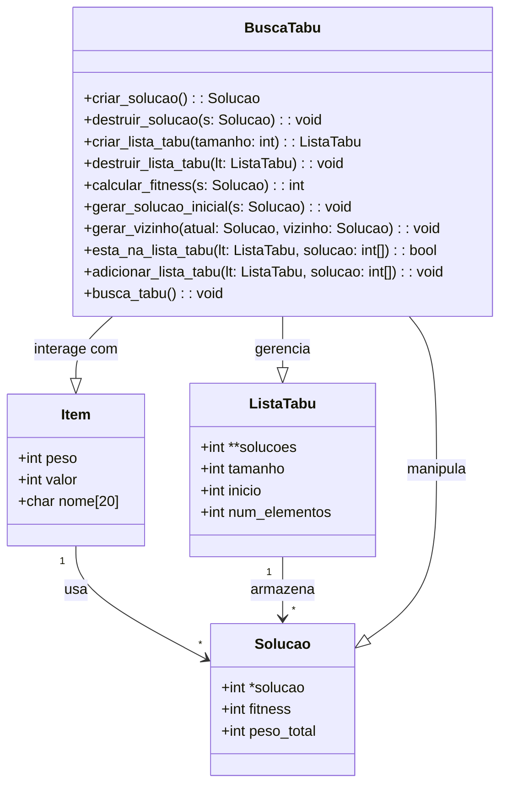

# Busca Tabu para o Problema da Mochila

Uma implementação sofisticada do algoritmo de Busca Tabu para resolver o Problema da Mochila 0-1 - um desafio clássico de otimização onde itens com diferentes pesos e valores devem ser selecionados para maximizar o valor total, respeitando uma restrição de capacidade de peso.

## Visão Geral

Esta implementação apresenta um algoritmo de Busca Tabu avançado com:
- Gerenciamento dinâmico de memória para espaços de solução
- Tamanho configurável da lista tabu e geração de vizinhança
- Acompanhamento de progresso e análise estatística
- Buffer circular eficiente para lista tabu
- Validação abrangente de soluções e verificação de restrições

## Componentes do Algoritmo

### Estruturas de Dados Principais



### Funcionalidades Principais

- **Gerenciamento da Lista Tabu**
  - Implementação em buffer circular para eficiência de memória
  - Tamanho configurável para diferentes escalas de problema
  - Busca rápida para validação de movimentos tabu

- **Geração de Vizinhança**
  - Seleção inteligente de movimentos baseada em restrições de peso
  - Adaptação dinâmica do tamanho da vizinhança
  - Verificação eficiente de viabilidade

- **Estratégia de Busca**
  - Seleção de movimento por melhor melhoria
  - Critérios de aspiração para override tabu
  - Oscilação estratégica entre intensificação e diversificação

## Configuração

### Parâmetros Principais

```c
#define NUM_ITENS 50      // Número de itens disponíveis
#define TABU_SIZE 20      // Capacidade da lista tabu
#define MAX_ITERATIONS 1000 // Máximo de iterações de busca
#define VIZINHOS_SIZE 100  // Tamanho da vizinhança por iteração
#define CAPACIDADE 20     // Capacidade da mochila
```

### Gerenciamento de Memória

A implementação utiliza alocação dinâmica de memória com limpeza cuidadosa:
- Vetores de solução alocados/desalocados sob demanda
- Lista tabu implementada como buffer circular
- Limpeza automática de todas as estruturas dinâmicas

## Compilação e Execução

### Compilação

Compilação de arquivo único:
```bash
gcc -Wall -O2 -o mochila_tabu algoritmoTabu.c
```

Com Make:
```bash
make mochila_tabu
```

### Execução

```bash
./mochila_tabu
```

## Formato da Saída

### Lista de Itens
```
+-----------+--------+--------+
| Item      | Peso   | Valor  |
+-----------+--------+--------+
| Item 1    |      5 |     12 |
| Item 2    |      3 |      8 |
...
```

### Progresso da Busca
```
+--------------------------------+
| Iteracao | Melhor Fitness      |
+--------------------------------+
|        0 |               45    |
|       10 |               52    |
...
```

### Solução Final
```
Melhor solucao encontrada:
Solucao: 1 0 1 0 1 ...
Fitness: 87
Peso Total: 19

Itens selecionados:
+-----------+--------+--------+
| Item      | Peso   | Valor  |
+-----------+--------+--------+
| Item 1    |      5 |     12 |
| Item 3    |      4 |     15 |
...
```

## Detalhes da Implementação

### Representação da Solução

- Vetor binário indicando itens selecionados
- Cálculo eficiente de fitness
- Validação de restrição de peso
- Rastreamento do histórico de soluções

### Componentes Principais

1. **Estrutura Item**
   - Representa itens individuais com peso, valor e nome
   - Gerados aleatoriamente no início da execução

2. **Estrutura Solucao**
   - Representa uma possível solução
   - Contém vetor binário de seleção de itens
   - Controla fitness e peso total

3. **Estrutura ListaTabu**
   - Implementa lista circular de soluções proibidas
   - Gerencia tamanho e número de elementos
   - Controla inserção e busca de soluções

### Mecanismos de Busca

1. **Geração da Solução Inicial**
   - Criação de solução viável aleatória
   - Satisfação da restrição de peso
   - Avaliação de fitness

2. **Exploração da Vizinhança**
   - Movimentos de troca de dois pontos
   - Manutenção de viabilidade
   - Avaliação eficiente de vizinhos

3. **Gerenciamento Tabu**
   - Restrições tabu baseadas em movimentos
   - Implementação em buffer circular
   - Tratamento de critérios de aspiração

4. **Condições de Término**
   - Máximo de iterações atingido
   - Detecção de estagnação (100 iterações sem melhoria)
   - Limiar de qualidade da solução
